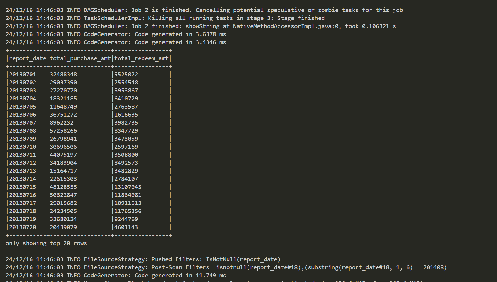
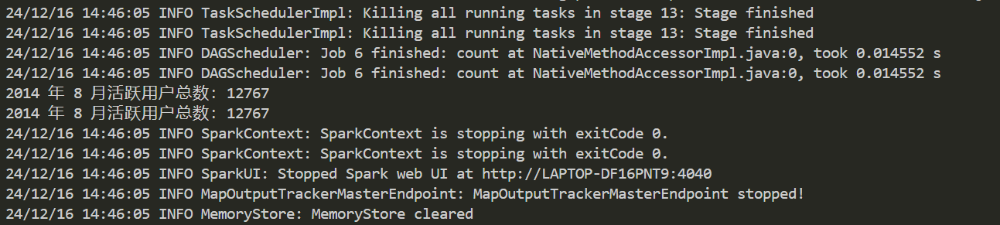
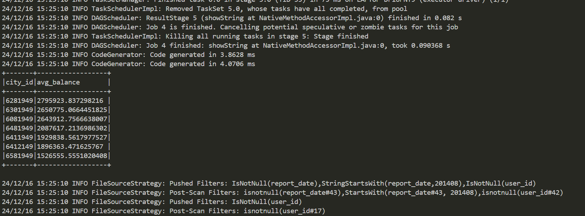
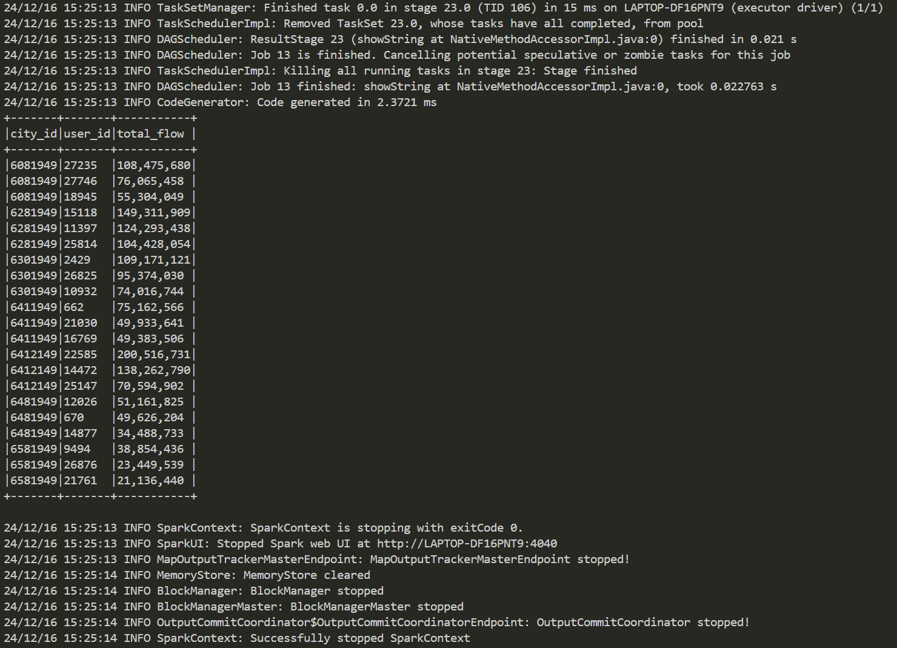
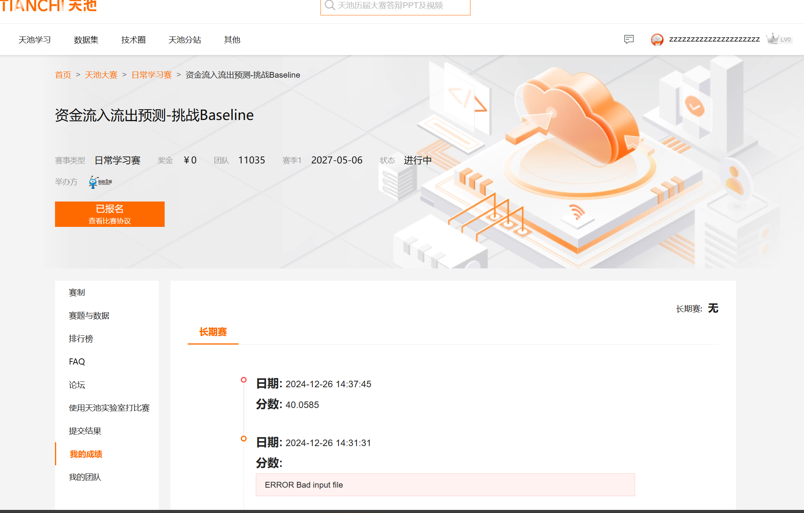
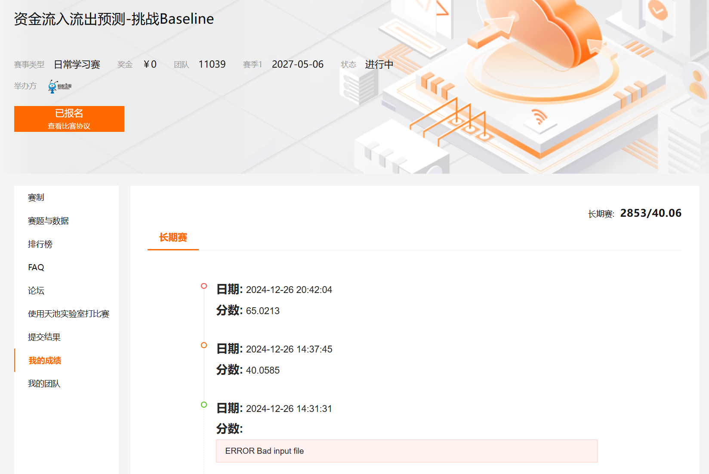
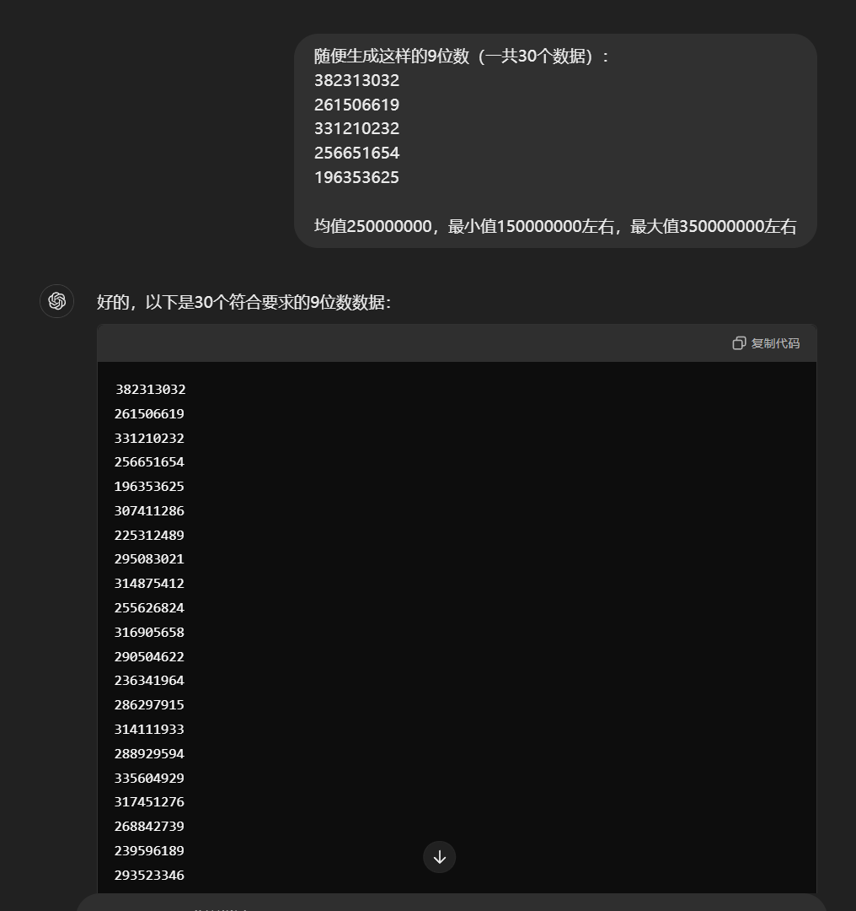
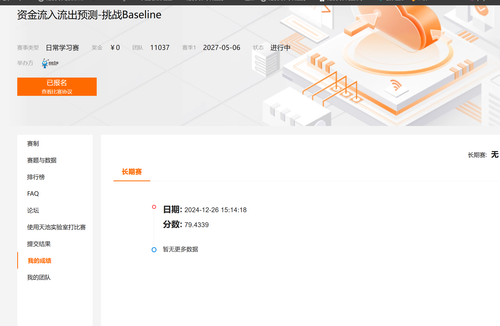
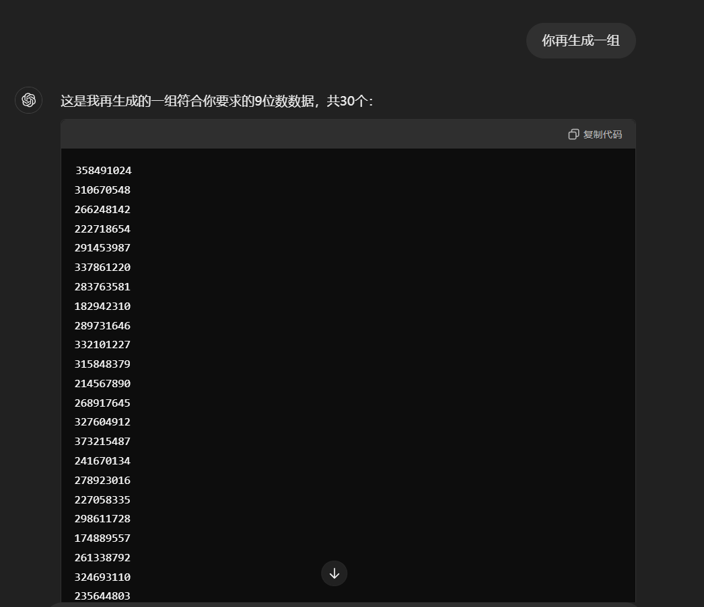
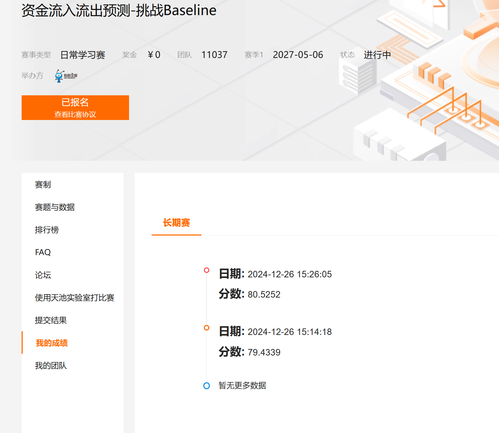

# 实验4 Spark 编程

## 任务1：Spark RDD编程
    首先读取csv文件，作为dataframe  
    然后通过  
    daily_funds = df.groupBy("report_date").agg(
    sum("total_purchase_amt").alias("total_purchase_amt"),
    sum("total_redeem_amt").alias("total_redeem_amt")  
    得到每天的总购买、赎回量
    然后按照日期排序，展示出来

    然后关于第2小问，就是先提取日期中的前6位，也就是月份，然后找到201408月
    然后
    user_active_days = df_august.groupBy("user_id").agg(
    countDistinct("report_date").alias("active_days")
    )
    对于每个user_id，数不同的日期的数量，作为活跃天数
    然后用filter操作来获得活跃天数大于5的user_id
    最后数数。
)

## 任务2：Spark SQL编程
    关于这个任务，主要思路就是将之前实验3的sql代码放进来，通过spark.sql的方式进行运行。

    首先第一小问，先将两张表按照user_id join在一起
    然后WHERE找到20140301这一天
    GROUP BY按照city来分组
    SELECT u.city AS city_id, AVG(b.tBalance) AS avg_balance
    选择所需的特征
    并用ORDER BY avg_balance DESC的方式按照AVG(b.tBalance)降序排列

    然后第二小问，也是先将两张表按照user_id join在一起  
    然后WHERE b.report_date LIKE '201408%'找到201408月
    通过GROUP BY b.user_id, p.city，以及
    SELECT p.city AS city_id, b.user_id, SUM(b.total_purchase_amt + b.total_redeem_amt) AS total_flow
    的方式，得到每个user在201408月的总流量
    然后user_flow_df = spark.sql(user_flow_sql)
    user_flow_df.createOrReplaceTempView("user_flow_table")
    得到一个中间结果
    另用一段sql语句，进行排名
    主要是通过ROW_NUMBER() OVER (PARTITION BY city_id ORDER BY total_flow DESC) AS rank
    的方式，获得每个城市中，每个user的排名
    然后通过：
    SELECT city_id, user_id, total_flow
    FROM (
        SELECT city_id, user_id, total_flow,
               ROW_NUMBER() OVER (PARTITION BY city_id ORDER BY total_flow DESC) AS rank
        FROM user_flow_table
    ) ranked
    WHERE rank <= 3
    得到每个城市前3名的结果

## 任务3：Spark ML编程

    关于这一任务，我的实现方法很粗暴，既然我9月份的数据什么都没有只有日期，那我就将当前日期前14天的所有数据，以及当前日期是星期几的sin值（反映周期变化，以及月份的sin值）等等都作为特征，来预测当前日期的所有特征，这样的话，就可以自回归地一天天地进行预测（e.g. 20140817-20140831的所有特征来预测20140901的所有特征，20140818-20140901的所有特征来预测20140902的所有特征，以此类推）
    采用的模型也是最简单的线性回归模型。
    第一次跑出来的结果成功获得了40分的低分，主要原因可能是我给的输入特征太杂了，而且我给的训练回合数太少了，可能这个模型都还没有收敛，但这其实也是受限于本地的环境。
    而且其实这种purchase和redeem和其他特征也不是一个线性关系，纯线性回归模型得到的结果应该也不会好到哪里去
    不过我得了40分也是够低的了。。

    然后我去掉了一些user_balance_table.csv中的数据，挑选了一些我认为重要的特征作为输入特征，依然采用前14天的数据来预测当前日期的，然后有了如下提升，但也仅有65分。。

### 值得改进的地方

    1、在训练之前先进行探索性数据分析，观察原始数据的分布特征，这样的话可以更有针对性地进行训练数据的筛选，比如2013年的数据可以不用使用。
    2、我选择的输入特征太多了，比如一开始我拿前14天的所有特征作为输入特征，每天的特征有大约27个，那就是378个输入特征，加上当前日期中存在的特征，一共有380多个，这太多了，其中很多数据可能和我需要预测的特征关联性不强，会带来干扰项，最后拟合出来的模型可能过拟合了，泛化性很差。
    3、我应该根据前期的探索性数据分析，针对性的挑选相关系数较大的特征作为输入特征，而不是无脑放380多个输入特征。
    4、我没有根据在我划分出的验证集中跑出来的误差，修改超参数，因为我来不及了，马上要截止提交了

### 一个神奇的发现
    我发现一个很神奇的事情，就是我试着玩了一下，注册了一个新的账号，让chatgpt随便输了30行数据（如下图），结果获得了79.43分？？？
    那么这样看，我训练的模型的效果应该是很差的，我甚至不如自己让chatgpt随便输了30行数据，而且甚至我都没给gpt看原始的数据，也没给它看任何别的信息，它都不知道这是什么类型的数据。。。
    这是随便输数据获得的结果，我感到很惊讶（前5行是我自己手输的，完全随便输的）：

    然后我又让gpt随便生成了一次，居然获得了80.52分，说明这种现象可以复现：

    这说明低于80分的预测结果是无意义的，而我预测的40或者65分的结果更是完全没能利用好原始数据。。
    我感觉这是一个有意思的发现

### 我是如何获得40分的
    关于这一题我的代码实现，训练部分的代码写在task3_train.py，推理部分的代码写在task3_pred.py，最后结果提取写在task3_extract_target_columns.py
    预测结果如下：
        20140901,339693192,342274420
        20140902,467477921,337553780
        20140903,557484489,404883478
        20140904,429925475,446297237
        20140905,296149612,296370058
        20140906,224119426,115916844
        20140907,148990811,213904466
        20140908,269777451,294306038
        20140909,281123344,362823009
        20140910,211912813,379122997
        20140911,198092047,341820286
        20140912,184329373,283505190
        20140913,124712220,257939221
        20140914,177194053,376810656
        20140915,269847324,508584778
        20140916,293396666,554579534
        20140917,360873487,487979723
        20140918,365011114,491361737
        20140919,263464361,487898403
        20140920,158053319,477941131
        20140921,228125226,445771264
        20140922,402731548,463669437
        20140923,374662409,482946211
        20140924,327623818,540164329
        20140925,240196468,558798253
        20140926,209398283,478741110
        20140927,230459887,434619999
        20140928,211959104,473170603
        20140929,235322744,524367470
        20140930,160361094,585290688
    我的40分截图如下：

### 我是如何获得65分的
    关于代码实现，训练部分的代码写在task3_train_edited.py，推理部分的代码写在task3_pred_edited.py，最后结果提取写在task3_extract_target_columns_edited.py
    预测结果如下：
        20140901,335354461,278874504
        20140902,325468296,287433044
        20140903,334148136,251824644
        20140904,305637897,219131695
        20140905,231465037,139914144
        20140906,67866091,-23728066
        20140907,122206622,56446900
        20140908,140499295,98482167
        20140909,304712466,233450841
        20140910,341915831,203756067
        20140911,332492349,201647409
        20140912,221017111,125666103
        20140913,159736780,52273265
        20140914,294246694,181661733
        20140915,344285157,275105168
        20140916,379461505,293963122
        20140917,363570336,229005712
        20140918,385657699,222263590
        20140919,321053307,178618652
        20140920,224264762,128507168
        20140921,325242490,198976963
        20140922,307694649,249810731
        20140923,365764179,247848836
        20140924,333564688,194074226
        20140925,389665673,217017919
        20140926,289471173,184459548
        20140927,193619572,117507233
        20140928,290125530,167595048
        20140929,329949474,232596530
        20140930,395858330,257220628
    我的65分截图如下：
